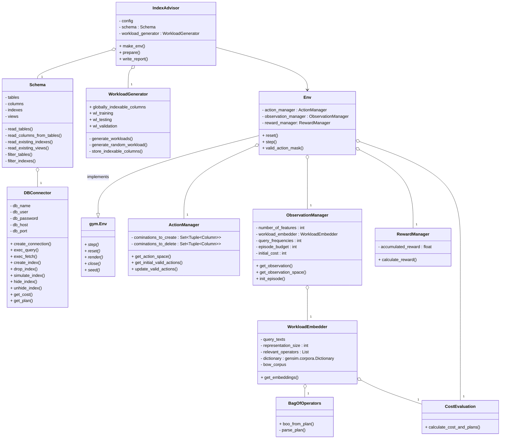

```mermaid
classDiagram
    direction TB

    class GymEnv["gym.Env"] {
        + step()*
        + reset()*
        + render()*
        + close()*
        + seed()*
    }
    class Env {
        - action_manager : ActionManager
        - observation_manager : ObservationManager
        - reward_manager: RewardManager
        
        + reset()
        + step()
        + valid_action_mask()
    }
    
    class ActionManager {
        - cominations_to_create : Set~Tuple~Column~~
        - cominations_to_delete : Set~Tuple~Column~~
        
        + get_action_space()
        + get_initial_valid_actions()
        + update_valid_actions()
    }
    class RewardManager {
        - accumulated_reward : float
        
        + calculate_reward()
    }
    class ObservationManager {
        - number_of_features : int
        - workload_embedder : WorkloadEmbedder
        - query_frequencies : int
        - episode_budget : int
        - initial_cost : int
        
        + get_observation()
        + get_observation_space()
        + init_episode()
    }
    class WorkloadEmbedder {
        - query_texts
        - representation_size : int
        - relevant_operators : List
        - dictionary : gensim.corpora.Dictionary
        - bow_corpus
        
        + get_embeddings()
    }
    class BagOfOperators {
        + boo_from_plan()
        - parse_plan()
    }
    
    class IndexAdvisor {
        - config
        - schema : Schema
        - workload_generator : WorkloadGenerator

        + make_env()
        + prepare()
        + write_report()
    }
    
    class Schema {
        - tables
        - columns
        - indexes
        - views
        
        - read_tables()
        - read_columns_from_tables()
        - read_existing_indexes()
        - read_existing_views()
        - filter_tables()
        - filter_indexes()
    }
    class WorkloadGenerator {
        + globally_indexable_columns
        + wl_training
        + wl_testing
        + wl_validation
        
        - generate_workloads()
        - generate_random_workload()
        - store_indexable_columns()
    }
    class DBConnector {
        - db_name
        - db_user
        - db_password
        - db_host
        - db_port
        
        + create_connection()
        
        + exec_query()
        + exec_fetch()
        
        + create_index()
        + drop_index()
        + simulate_index()
        + hide_index()
        + unhide_index()
        
        + get_cost()
        + get_plan()
    }
    
    class CostEvaluation {
        + calculate_cost_and_plans()
    }
    
    Env --|> GymEnv : implements
    
    Env o-- "1" ActionManager
    Env o-- "1" ObservationManager
    Env o-- "1" RewardManager
    Env o-- "1" CostEvaluation
    
    ObservationManager o-- "1" WorkloadEmbedder
    
    WorkloadEmbedder o-- "1" BagOfOperators
    WorkloadEmbedder o-- "1" CostEvaluation
    
    IndexAdvisor o-- "1" Schema
    IndexAdvisor o-- "1" WorkloadGenerator
    
    Schema o-- "1" DBConnector
    
    IndexAdvisor --> Env
```